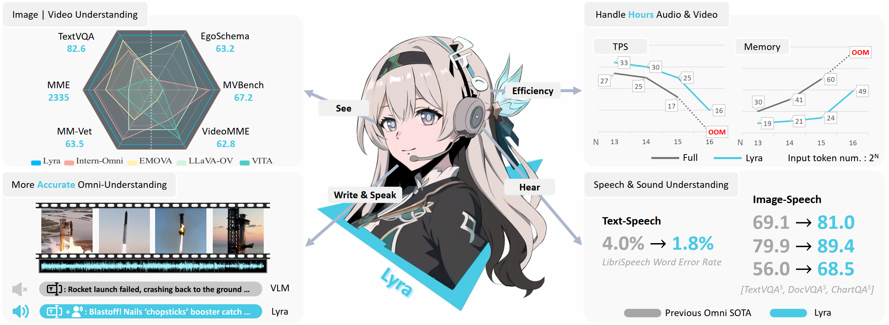
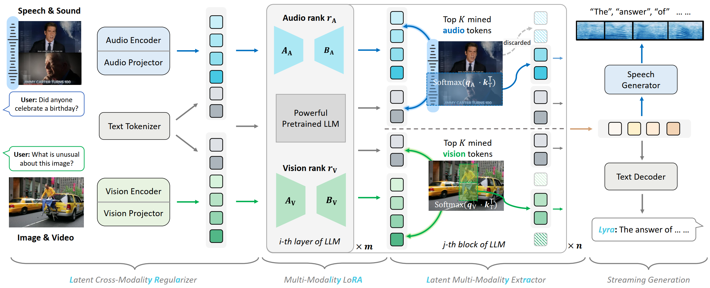

#  <span style="font-size:30px;">Lyra: An Efficient and Speech-Centric Framework for Omni-Cognition</span>

<a href='https://mini-gemini.github.io/'></a>
<a href='http://103.170.5.190:7860/'></a>
<a href='https://huggingface.co/spaces/wcy1122/MGM'></a>
<a href='https://arxiv.org/pdf/2403.18814.pdf'></a>
<a href='https://huggingface.co/collections/YanweiLi/mgm-6603c50b9b43d044171d0854'></a>
<a href='https://huggingface.co/collections/YanweiLi/mgm-data-660463ea895a01d8f367624e'></a>


Overview of Lyra:
<div align=center>

</div>

Lyra shows superiority compared with leading omni-models in:

1. Stronger performance: achieve SOTA results across a variety of speech-centric tasks.
2. More versatile:  Support image, video, speech/long-speech, sound understanding and speech generation.
3. More efficient: Less training data, support faster training and inference.

## Release
- [12/12] 🔥 Lyra is coming! We release the [paper](https://arxiv.org/pdf/2403.18814.pdf), [demo](http://103.170.5.190:7860/), [code](https://github.com/dvlab-research/MGM), [models](https://huggingface.co/collections/YanweiLi/mgm-6603c50b9b43d044171d0854'). More related data and checkpoints will be released soon!

## Contents
- [Demo](#demo)
- [Install](#install)
- [Model](#model)
- [Preparation](#preparation)
- [Train](#train)
- [Evaluation](#evaluation)
- [Examples](#examples)
- [Citation](#citation)
- [Acknowledgement](#acknowledgement)
- [License](#license)

## Demo
We provide some selected examples in this section. More examples can be found in our [project page](https://mini-gemini.github.io/). Feel free to try our online [demo](http://103.170.5.190:7860/)!

```html
<p align="center" width="80%">
  <a href="https://youtu.be/7kh-M0jmmtI" target="_blank">
    
  </a>
</p>
```


## Install
Please follow the instructions below to install the required packages.

1. Clone this repository:
```bash
git clone https://github.com/dvlab-research/Lyra.git
```

2. Install Package:
```bash
conda create -n lyra python=3.10 -y
conda activate lyra
cd Lyra
pip install --upgrade pip
pip install -e .
```

3. Install optional packages for simultaneous text-speech generation:
```bash
pip install pip==24.0
pip install fairseq==0.12.2
pip install --upgrade pip
```

## Model

<div align=center>

</div>


Lyra supports multi-modal inputs. When the data contains a speech modality, we use the **latent cross-modality regularizer** to assist. Data from each modality is processed through encoders and projectors before being sent into the LLM. Within the LLM, **multi-modality LoRA** and l**atent multi-modality extraction** modules operate synergistically, facilitating the **simultaneous generation** of both speech and text outputs.

## Evaluation

<table>
  <tr>
    <th rowspan="2">Omni Comparison</th>
    <th rowspan="2">Params.</th>
    <th colspan="3" align="center">Text-Image</th>
    <th colspan="3" align="center">Text-Video</th>
    <th colspan="3" align="center">Image-Speech</th>
    <th rowspan="1">Text-Speech</th>
  </tr>
  <tr>
    <th>TextVQA</th>
    <th>MME</th>
    <th>MM-Vet</th>
    <th>VideoMME</th>
    <th>MVBench</th>
    <th>Egoschema</th>
    <th>TextVQA<sup>s</sup></th>
    <th>DocVQA<sup>s</sup></th>
    <th>ChartQA<sup>s</sup></th>
    <th>LibriSpeech</th>
  </tr>
  <tr>
    <td>Mini-Gemini</td>
    <td>8B</td>
    <td>71.9</td>
    <td>1989</td>
    <td>53.5</td>
    <td>-</td>
    <td>-</td>
    <td>-</td>
    <td>-</td>
    <td>-</td>
    <td>-</td>
    <td>-</td>
  </tr>
  <tr>
    <td>LLaVA-OV</td>
    <td>7B</td>
    <td>65.4</td>
    <td>1998</td>
    <td>57.5</td>
    <td>58.2</td>
    <td>56.7</td>
    <td>60.1</td>
    <td>-</td>
    <td>-</td>
    <td>-</td>
    <td>-</td>
  </tr>
  <tr>
    <td>Intern-VL2</td>
    <td>8B</td>
    <td>77.4</td>
    <td>2211</td>
    <td>60.0</td>
    <td>54.0</td>
    <td>-</td>
    <td>-</td>
    <td>-</td>
    <td>-</td>
    <td>-</td>
    <td>-</td>
  </tr>
  <tr>
    <td>Mini-Omni</td>
    <td>7B</td>
    <td>-</td>
    <td>-</td>
    <td>-</td>
    <td>-</td>
    <td>-</td>
    <td>-</td>
    <td>-</td>
    <td>-</td>
    <td>-</td>
    <td>4.5</td>
  </tr>
  <tr>
    <td>SALMONN</td>
    <td>13B</td>
    <td>-</td>
    <td>-</td>
    <td>-</td>
    <td>-</td>
    <td>-</td>
    <td>-</td>
    <td>-</td>
    <td>-</td>
    <td>-</td>
    <td>2.1</td>
  </tr>
  <tr>
    <td>Qwen2-Audio</td>
    <td>8B</td>
    <td>-</td>
    <td>-</td>
    <td>-</td>
    <td>-</td>
    <td>-</td>
    <td>-</td>
    <td>-</td>
    <td>-</td>
    <td>-</td>
    <td>1.6</td>
  </tr>
  <tr>
    <td>Intern-Omni</td>
    <td>8B</td>
    <td>80.6</td>
    <td>2210</td>
    <td>60.0</td>
    <td>-</td>
    <td>-</td>
    <td>-</td>
    <td>69.1</td>
    <td>79.9</td>
    <td>56.0</td>
    <td>-</td>
  </tr>
  <tr>
    <td>VITA</td>
    <td>66B</td>
    <td>-</td>
    <td>2097</td>
    <td>41.6</td>
    <td>59.2</td>
    <td>-</td>
    <td>-</td>
    <td>-</td>
    <td>-</td>
    <td>-</td>
    <td>8.1</td>
  </tr>
  <tr>
    <td>EMOVA</td>
    <td>14B</td>
    <td>82.0</td>
    <td>2205</td>
    <td>55.8</td>
    <td>-</td>
    <td>-</td>
    <td>-</td>
    <td>-</td>
    <td>-</td>
    <td>-</td>
    <td>4.0</td>
  </tr>
  <tr>
    <td><b>Lyra-Mini</b></td>
    <td>3B</td>
    <td>78.3</td>
    <td>1884</td>
    <td>51.2</td>
    <td>55.0</td>
    <td>62.5</td>
    <td>54.1</td>
    <td>73.9</td>
    <td>75.0</td>
    <td>40.7</td>
    <td>2.1</td>
  </tr>
  <tr>
    <td><b>Lyra-Base</b></td>
    <td>9B</td>
    <td>82.6</td>
    <td>2335</td>
    <td>63.5</td>
    <td>62.8</td>
    <td>67.2</td>
    <td>63.2</td>
    <td>80.0</td>
    <td>85.5</td>
    <td>61.0</td>
    <td>2.0</td>
  </tr>
  <tr>
    <td><b>Lyra-Pro</b></td>
    <td>74B</td>
    <td>83.5</td>
    <td>2485</td>
    <td>71.4</td>
    <td>69.9</td>
    <td>72.3</td>
    <td>75.8</td>
    <td>81.0</td>
    <td>89.4</td>
    <td>68.5</td>
    <td>1.8</td>
  </tr>
</table>


## Citation
If you find this repo useful for your research, please consider citing the paper
```
@article{zhong2024lyra,
  title={Lyra: An Efficient and Speech-Centric Framework for Omni-Cognition},
  author={Zhong, Zhingsheng and Wang, Chengyao and Liu, Yuqi and Yang, Senqiao and Tang, Longxiang and Zhang, Yuechen and Li, Jingyao and Qu, Tianyuan and Li, Yanwei and Chen, Yukang and Yu, Shaozuo and Wu, Sitong and Lo, Eric and Liu, Shu and Jia, Jiaya},
  journal={arXiv preprint arXiv:xxxx.xxxx},
  year={2024}
}
```

## Acknowledgement
We would like to thank the following repos for their great work:

- This work is built upon the [LLaVA Series](https://github.com/LLaVA-VL/LLaVA-NeXT), [Mini-Gemini](https://github.com/dvlab-research/MGM), [LLaMA-Omni](https://github.com/ictnlp/LLaMA-Omni), [fairseq](https://github.com/facebookresearch/fairseq), [lmms-eval](https://github.com/EvolvingLMMs-Lab/lmms-eval).
- This work utilizes models from [Qwen2-VL](https://huggingface.co/Qwen/Qwen2-VL-7B-Instruct), [Qwen2 Series](https://huggingface.co/Qwen/Qwen2.5-7B-Instruct), [LLaMA3 Series](https://huggingface.co/meta-llama/Llama-3.2-11B-Vision), and [Whisper](https://huggingface.co/openai/whisper-large-v3).

## License
[](https://github.com/dvlab-research/Lyra/blob/main/LICENSE)
[](https://github.com/dvlab-research/Lyra/blob/main/DATA_LICENSE)
[](https://github.com/dvlab-research/Lyra/blob/main/WEIGHT_LICENSE)

The data and checkpoint is intended and licensed for research use only. They are also restricted to uses that follow the license agreement of LLaVA, Qwen, LLaMA, Whisper, and GPT-4o. The dataset is CC BY NC 4.0 (allowing only non-commercial use) and models trained using the dataset should not be used outside of research purposes.