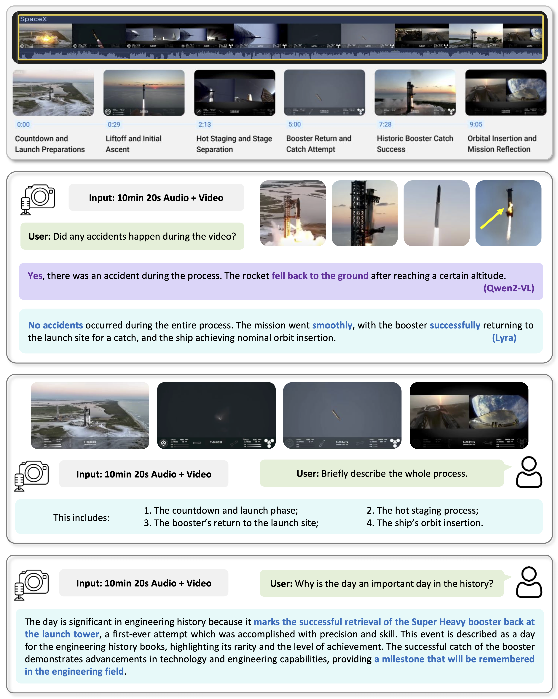
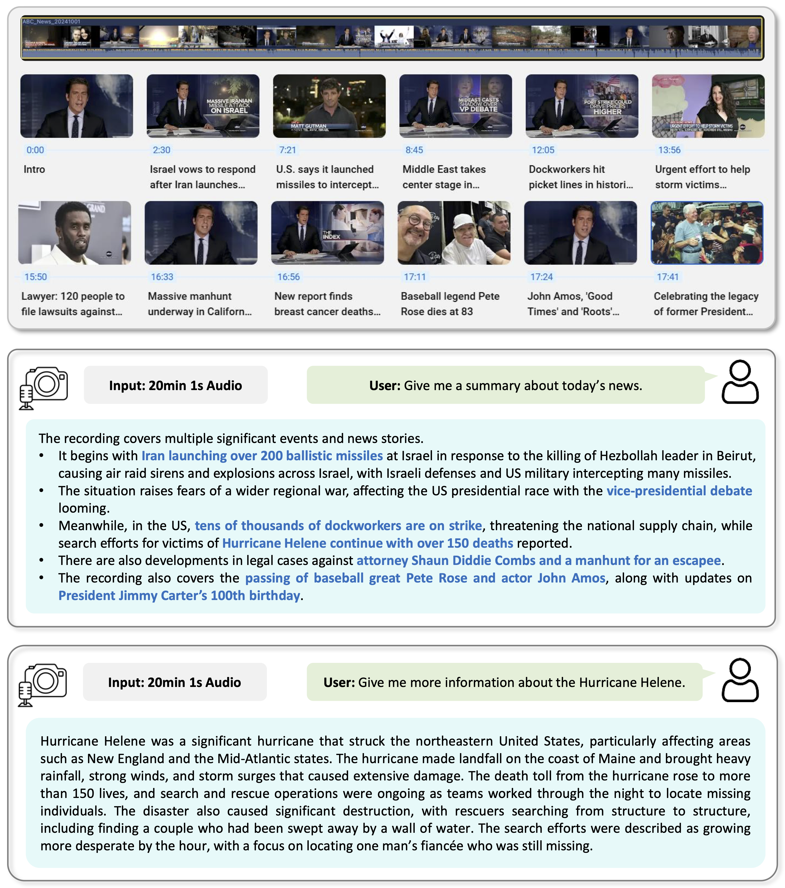

#  <span style="font-size:30px;">Lyra: An Efficient and Speech-Centric Framework <br>for Omni-Cognition</span>

<a href='https://lyra-omni.github.io/'></a>
<a href='https://103.170.5.190:17860/'></a>
<a href='https://arxiv.org/pdf/2412.09501.pdf'></a>
<a href='https://huggingface.co/collections/zszhong/lyra-model-674ea5bb3b39ff8f15de75fc'></a>
<a href='https://huggingface.co/collections/zszhong/lyra-data-675ae0266403ecb5a2d02352'></a>
<a href='https://huggingface.co/collections/zszhong/lyra-eval-675afaafd1f326275b6349c4'></a>


Overview of Lyra:
<div align=center>

</div>

Lyra shows superiority compared with leading omni-models in:

1. Stronger performance: Achieve SOTA results across a variety of speech-centric tasks.
2. More versatile:  Support image, video, speech/long-speech, sound understanding and speech generation.
3. More efficient: Less training data, support faster training and inference.

## Release
- [12/12] 🔥 Lyra is coming! We release the [paper](https://arxiv.org/pdf/2412.09501.pdf), [demo](https://103.170.5.190:17860/), [code](https://github.com/dvlab-research/Lyra), [models](https://huggingface.co/collections/zszhong/lyra-model-674ea5bb3b39ff8f15de75fc'). More related data and checkpoints will be released soon!

## Contents
- [Demo](#demo)
- [Install](#install)
- [Model](#model)
- [Preparation](#preparation)
- [Train](#train)
- [Evaluation](#evaluation)
- [Examples](#examples)
- [Citation](#citation)
- [Acknowledgement](#acknowledgement)
- [License](#license)

## Demo
We provide [video demo](https://www.youtube.com/watch?v=7kh-M0jmmtI) here for better experience and illustrations. More examples can be found in our [project page](https://lyra-omni.github.io/) and feel free to try our [online demo](https://103.170.5.190:17860/)! Due to the computing cost, GPU memory of the demo machine (3090), and uploading storage, the long-speech function is not supported for the current online demo. 😰

<p align="center" width="98%">
  <a href="https://youtu.be/7kh-M0jmmtI" target="_blank">
    
  </a>
</p>


## Install
Please follow the instructions below to install the required packages.

1. Clone this repository:
```bash
git clone https://github.com/dvlab-research/Lyra.git
```

2. Install Package:
```bash
conda create -n lyra python=3.10 -y
conda activate lyra
cd Lyra
pip install --upgrade pip
pip install -e .
```

3. Install optional packages for simultaneous text-speech generation:
```bash
pip install pip==24.0
pip install fairseq==0.12.2
pip install --upgrade pip
```

## Model

<div align=center>

</div>


Lyra supports multi-modal inputs. When the data contains a speech modality, we use the **latent cross-modality regularizer** to assist. Data from each modality is processed through encoders and projectors before being sent into the LLM. Within the LLM, **multi-modality LoRA** and l**atent multi-modality extraction** modules operate synergistically, facilitating the **simultaneous generation** of both speech and text outputs.

## Preparation
### Dataset

We provide the processed data for the model training. 

For **model pretraining data**, please download the following the training multi-modality data and organize them as:

`->` means put the data in the local folder.

- [LibriSpeech](https://www.openslr.org/12) -> `data/Lyra_Pretrain/LibriSpeech` 

  ​              and -> `data/Lyra_SFT_MM_speech/LibriSpeech` download all training and develop data.

- [Common Voice](https://commonvoice.mozilla.org/en/datasets) -> `data/Lyra_Pretrain/CommonVoice` download the English Common Voice Corpus.

During the pretraining process, we filtered out some noisy and short audio speech data.

For the **image part of finetuning data**, similar to Mini-Gemini, please download the following the instruction data and organize them as:

`->` means put the data in the local folder.

- [COCO train2017](http://images.cocodataset.org/zips/train2017.zip) -> `data/Lyra_Finetune/coco`
- [GQA](https://downloads.cs.stanford.edu/nlp/data/gqa/images.zip) -> `data/Lyra_Finetune/gqa`
- [OCR-VQA](https://drive.google.com/drive/folders/1_GYPY5UkUy7HIcR0zq3ZCFgeZN7BAfm_?usp=sharing) (**we save all files as `.jpg`**) -> `data/Lyra_Finetune/ocr_vqa`
- [TextVQA](https://dl.fbaipublicfiles.com/textvqa/images/train_val_images.zip) (not included for training) -> `data/Lyra_Finetune/textvqa`
- [VisualGenome part1](https://cs.stanford.edu/people/rak248/VG_100K_2/images.zip), [VisualGenome part2](https://cs.stanford.edu/people/rak248/VG_100K_2/images2.zip) -> `data/Lyra_Finetune/vg`
- [ShareGPT4V-100K](https://github.com/InternLM/InternLM-XComposer/blob/main/projects/ShareGPT4V/docs/Data.md) -> `data/Lyra_Finetune/sam`, `share_textvqa`, `wikiart`, `web-celebrity`, `web-landmark`
- [LAION GPT4V](https://huggingface.co/datasets/laion/gpt4v-dataset) -> `data/Lyra_Finetune/gpt4v-dataset`
- [ALLaVA Instruction](https://github.com/FreedomIntelligence/ALLaVA) -> `data/Lyra_Pretrain/ALLaVA-4V`
- [DocVQA](https://www.docvqa.org/datasets/docvqa) -> `data/Lyra_Finetune/docvqa`
- [ChartQA](https://github.com/vis-nlp/ChartQA) -> `data/Lyra_Finetune/chartqa`
- [DVQA](https://github.com/kushalkafle/DVQA_dataset) -> `data/Lyra_Finetune/dvqa`
- [AI2D](https://allenai.org/data/diagrams) -> `data/Lyra_Finetune/ai2d`

For the **audio part of finetuning data**, please download the following the instruction data and organize them as:

`->` means put the data in the local folder.

- [Lyra_MultiModal](https://huggingface.co/datasets/zszhong/Lyra_MultiModal) -> `data/Lyra_SFT_MM_speech/Lyra_MultiModal` 

  For details, please refer the [Lyra multi-modality preparation]().

For the **long speech** audio finetuning data, please download the following the instruction data and organize them as:

`->` means put the data in the local folder.

- [Lyra_LongSpeech](https://huggingface.co/datasets/zszhong/Lyra_LongSpeech) -> `data/Lyra_SFT_longspeech/Lyra_LongSpeech`

  For details, please refer the [Lyra long-speech preparation]().

For the **text-speech generation** data, please download the following the instruction data and organize them as:

`->` means put the data in the local folder.

- [Lyra_SpeechGeneration](https://huggingface.co/datasets/zszhong/Lyra_SpeechGeneration)  -> `data/Lyra_speech_generation` 

  For details, please refer the [Lyra speech generation preparation]().

For **model evaluation data**, to be release soon!

Please put the pretrained data, finetuned data, and eval data in  `Lyra_Pretrain`, `Lyra_SFT`, and `Lyra_Eval` subset following [Structure](#structure).

### Pretrained Weights

We recommend users to download the pretrained weights from the following link Qwen2VL_2B_LLM, Qwen2VL_7B_LLM, Qwen2VL_70B_LLM, Qwen2VL_2B_ViT, Qwen2VL_7B_ViT, Qwen2VL_70B_ViT, [whisper-large-v3-turbo](https://huggingface.co/openai/whisper-large-v3-turbo), [whisper-large-v3](https://huggingface.co/openai/whisper-large-v3),  [imagebind_huge](https://dl.fbaipublicfiles.com/imagebind/imagebind_huge.pth), and put them in `model_zoo` following [Structure](#structure).

Download the unit-based HiFi-GAN vocoder using the follow commands:

```shell
wget https://dl.fbaipublicfiles.com/fairseq/speech_to_speech/vocoder/code_hifigan/mhubert_vp_en_es_fr_it3_400k_layer11_km1000_lj/g_00500000 -P model_zoo/audio/vocoder/
wget https://dl.fbaipublicfiles.com/fairseq/speech_to_speech/vocoder/code_hifigan/mhubert_vp_en_es_fr_it3_400k_layer11_km1000_lj/config.json -P model_zoo/audio/vocoder/
```

### Structure

The folder structure should be organized as follows before training.

```
Lyra
├── lyra
├── scripts
├── work_dirs
│   ├── Lyra
│   │   ├── Lyra_Mini_3B
│   │   ├── Lyra_Base_9B
│   │   ├── Lyra_Pro_74B
│   │   ├── ...
├── model_zoo
│   ├── LLM
│   │   ├── Qwen2VL_2B_LLM
│   │   ├── Qwen2VL_7B_LLM
│   │   ├── Qwen2VL_70B_LLM
│   │   ├── Qwen2.5
│   │   ├── LLaMA3.2
│   │   ├── ...
│   ├── vision
│   │   ├── Qwen2VL_2B_ViT
│   │   ├── Qwen2VL_7B_ViT
│   │   ├── Qwen2VL_70B_ViT
│   │   ├── clip-vit-large
│   │   ├── siglip
│   │   ├── ConvNeXt
│   │   ├── ...
│   ├── audio
│   │   ├── whisper-large-v3-turbo
│   │   ├── whisper-large-v3
│   │   ├── imagebind_huge
│   │   ├── vocoder
│   │   ├── ...
├── data
│   ├── Lyra_Pretrain
│   │   ├── lyra_pretrain.json
│   │   ├── LibriSpeech
│   │   ├── CommonVoice
│   ├── Lyra_SFT_MM_speech
│   │   ├── lyra_multimodal.json
│   │   ├── Lyra_MultiModal
│   │   ├── LibriSpeech
│   ├── Lyra_SFT_MM_image (similar to MGM-Finetune)
│   │   ├── llava
│   │   ├── coco
│   │   ├── gqa
│   │   ├── ocr_vqa
│   │   ├── textvqa
│   │   ├── vg
│   │   ├── gpt4v-dataset
│   │   ├── ...
│   ├── Lyra_SFT_longspeech
│   │   ├── lyra_longspeech.json
│   │   ├── Lyra_LongSpeech
│   ├── Lyra_speech_generation
│   │   ├── lyra_speechgeneration.json
│   ├── Lyra_Eval
│   │   ├── MM-Vet
│   │   ├── TextVQA
│   │   ├── VideoMME
│   │   ├── ...
```

## Train

To be release soon!


## Evaluation

### Benchmarks Results

<table>
  <tr>
    <th rowspan="2">Omni Comparison</th>
    <th rowspan="2">Params.</th>
    <th colspan="3" align="center">Text-Image</th>
    <th colspan="3" align="center">Text-Video</th>
    <th colspan="3" align="center">Image-Speech</th>
    <th rowspan="1">Text-Speech</th>
  </tr>
  <tr>
    <th>TextVQA</th>
    <th>MME</th>
    <th>MM-Vet</th>
    <th>VideoMME</th>
    <th>MVBench</th>
    <th>Egoschema</th>
    <th>TextVQA<sup>s</sup></th>
    <th>DocVQA<sup>s</sup></th>
    <th>ChartQA<sup>s</sup></th>
    <th>LibriSpeech</th>
  </tr>
  <tr>
    <td>Mini-Gemini</td>
    <td>8B</td>
    <td>71.9</td>
    <td>1989</td>
    <td>53.5</td>
    <td>-</td>
    <td>-</td>
    <td>-</td>
    <td>-</td>
    <td>-</td>
    <td>-</td>
    <td>-</td>
  </tr>
  <tr>
    <td>LLaVA-OV</td>
    <td>7B</td>
    <td>65.4</td>
    <td>1998</td>
    <td>57.5</td>
    <td>58.2</td>
    <td>56.7</td>
    <td>60.1</td>
    <td>-</td>
    <td>-</td>
    <td>-</td>
    <td>-</td>
  </tr>
  <tr>
    <td>Intern-VL2</td>
    <td>8B</td>
    <td>77.4</td>
    <td>2211</td>
    <td>60.0</td>
    <td>54.0</td>
    <td>-</td>
    <td>-</td>
    <td>-</td>
    <td>-</td>
    <td>-</td>
    <td>-</td>
  </tr>
  <tr>
    <td>Mini-Omni</td>
    <td>7B</td>
    <td>-</td>
    <td>-</td>
    <td>-</td>
    <td>-</td>
    <td>-</td>
    <td>-</td>
    <td>-</td>
    <td>-</td>
    <td>-</td>
    <td>4.5</td>
  </tr>
  <tr>
    <td>SALMONN</td>
    <td>13B</td>
    <td>-</td>
    <td>-</td>
    <td>-</td>
    <td>-</td>
    <td>-</td>
    <td>-</td>
    <td>-</td>
    <td>-</td>
    <td>-</td>
    <td>2.1</td>
  </tr>
  <tr>
    <td>Qwen2-Audio</td>
    <td>8B</td>
    <td>-</td>
    <td>-</td>
    <td>-</td>
    <td>-</td>
    <td>-</td>
    <td>-</td>
    <td>-</td>
    <td>-</td>
    <td>-</td>
    <td>1.6</td>
  </tr>
  <tr>
    <td>Intern-Omni</td>
    <td>8B</td>
    <td>80.6</td>
    <td>2210</td>
    <td>60.0</td>
    <td>-</td>
    <td>-</td>
    <td>-</td>
    <td>69.1</td>
    <td>79.9</td>
    <td>56.0</td>
    <td>-</td>
  </tr>
  <tr>
    <td>VITA</td>
    <td>66B</td>
    <td>-</td>
    <td>2097</td>
    <td>41.6</td>
    <td>59.2</td>
    <td>-</td>
    <td>-</td>
    <td>-</td>
    <td>-</td>
    <td>-</td>
    <td>8.1</td>
  </tr>
  <tr>
    <td>EMOVA</td>
    <td>14B</td>
    <td>82.0</td>
    <td>2205</td>
    <td>55.8</td>
    <td>-</td>
    <td>-</td>
    <td>-</td>
    <td>-</td>
    <td>-</td>
    <td>-</td>
    <td>4.0</td>
  </tr>
  <tr>
    <td><b>Lyra-Mini</b></td>
    <td>3B</td>
    <td>78.3</td>
    <td>1884</td>
    <td>51.2</td>
    <td>55.0</td>
    <td>62.5</td>
    <td>54.1</td>
    <td>73.9</td>
    <td>75.0</td>
    <td>40.7</td>
    <td>2.1</td>
  </tr>
  <tr>
    <td><b>Lyra-Base</b></td>
    <td>9B</td>
    <td>82.6</td>
    <td>2335</td>
    <td>63.5</td>
    <td>62.8</td>
    <td>67.2</td>
    <td>63.2</td>
    <td>80.0</td>
    <td>85.5</td>
    <td>61.0</td>
    <td>2.0</td>
  </tr>
  <tr>
    <td><b>Lyra-Pro</b></td>
    <td>74B</td>
    <td>83.5</td>
    <td>2485</td>
    <td>71.4</td>
    <td>69.9</td>
    <td>72.3</td>
    <td>75.8</td>
    <td>81.0</td>
    <td>89.4</td>
    <td>68.5</td>
    <td>1.8</td>
  </tr>
</table>


### Benchmarks scripts

To be release soon!

### CLI Inference

Chat with images without the need of Gradio interface. It also supports multiple GPUs, 4-bit and 8-bit quantized inference.
Please make sure you have installed [fairseq](https://github.com/facebookresearch/fairseq) for speech generation, and try the following command for speech and generation inference:

```bash
python -m lyra.serve.cli                                  \
	--model-path path/to/Lyra_Base_9B                 \
	--image-file examples/Chinese_painting.jpg        \ # <path to your image: context>
	--speech-file examples/Chinese_painting.mp3       \ # <path to your audio: instruction>
	--generate-speech                                   # examples/pred_roundX.wav
```

Lyra can also handle the long speech input (max duration can be about two or three hours).

Here is an example: [ABC New, Oct. 1, 2024](https://www.youtube.com/watch?v=A7LTOsf7JMQ&t=1063s), 20 mins:

```bash
python -m lyra.serve.cli                                  \
	--model-path path/to/Lyra_Base_9B                 \
	--speech-file examples/ABC_News_20241001.mp3      \ # <path to your long audio: context>
	--generate-speech                                   # text instuction by the keyboard input
```

You can also try 8bit or even 4bit for efficient inference: 
```bash
python -m lyra.serve.cli                                  \
    --model-path path/to/Lyra_Base_9B                     \
    --image-file examples/extreme_ironing.jpg             \
    --speech-file examples/extreme_ironing.mp3            \
    --generate-speech 
    --load-8bit
```

### Gradio Web UI

To be release soon!


## Examples
We provide some examples in this section. More examples can be found in our [project page](https://lyra-omni.github.io/).

<div align=center>

</div>

<div align=center>

</div>


## Citation
If you find this repo useful for your research, please consider citing the paper😊:
```
@article{zhong2024lyra,
  title={Lyra: An Efficient and Speech-Centric Framework for Omni-Cognition},
  author={Zhong, Zhingsheng and Wang, Chengyao and Liu, Yuqi and Yang, Senqiao and Tang, Longxiang and Zhang, Yuechen and Li, Jingyao and Qu, Tianyuan and Li, Yanwei and Chen, Yukang and Yu, Shaozuo and Wu, Sitong and Lo, Eric and Liu, Shu and Jia, Jiaya},
  journal={arXiv preprint arXiv:2412.09501},
  year={2024}
}
```

## Acknowledgement
We would like to thank the following repos for their great work:

- This work is built upon the [LLaVA Series](https://github.com/LLaVA-VL/LLaVA-NeXT), [Mini-Gemini](https://github.com/dvlab-research/MGM), [LLaMA-Omni](https://github.com/ictnlp/LLaMA-Omni), [fairseq](https://github.com/facebookresearch/fairseq), [lmms-eval](https://github.com/EvolvingLMMs-Lab/lmms-eval).
- This work utilizes models from [Qwen2-VL](https://huggingface.co/Qwen/Qwen2-VL-7B-Instruct), [Qwen2 Series](https://huggingface.co/Qwen/Qwen2.5-7B-Instruct), [LLaMA3 Series](https://huggingface.co/meta-llama/Llama-3.2-11B-Vision), and [Whisper](https://huggingface.co/openai/whisper-large-v3).

## License
[](https://github.com/dvlab-research/Lyra/blob/main/LICENSE)
[](https://github.com/dvlab-research/Lyra/blob/main/DATA_LICENSE)
[](https://github.com/dvlab-research/Lyra/blob/main/WEIGHT_LICENSE)

The data and checkpoint is intended and licensed for research use only. They are also restricted to uses that follow the license agreement of LLaVA, Qwen, LLaMA, Whisper, and GPT-4o. The dataset is CC BY NC 4.0 (allowing only non-commercial use) and models trained using the dataset should not be used outside of research purposes.